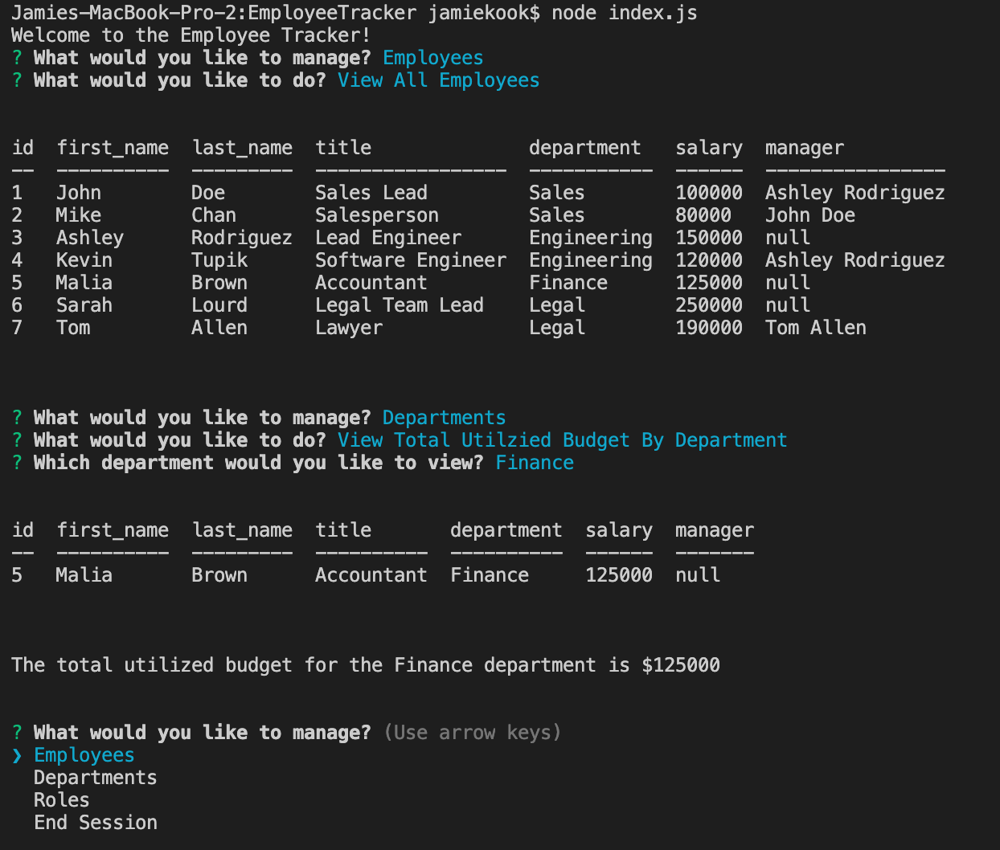

# EmployeeTracker
A command-line application that allows users to view and update employees, roles, and departments. 

## Installation

Clone folder onto your own computer by forking the repository and using the "Clone or download" button on github.

Install all npm modules using the command "npm install".

Create your mySQL database in your mySQL workbench using the schema.sql file in the root folder. 

You can pre-seed the database in your mySQL workbench using the seed.sql file in the root folder.

****Update your connection information in the sql_queries.js file located in the lib folder.

Run the server by calling node index.js from the commandline open in the root folder to run the application.

## Functionality
Upon loading the applications users are prompted to select what she/he would like to manage: Employees, Departments, or Roles. Each selection has its own functionalities. 

### Employee Management
In the employee management selection, users can view all employees, view employees by department, view employees by manager, add a new employee, remove an employee, or update an employee's role or manager. 

#### Adding Employees
When adding employees, user's input is validated to ensure that she/he inputs a name and that there are only inserting letters and not using special characters or numbers. If the user fails to meet validation criteria, she/he are informed that the employee was not added to the database and re-routed to the main menu. 

Once the information is validated, the casing of the employee's name will automatically be set to have the first letter of each name as the only capitalized one. 

If the employee being added has the same name as a current employee, the user is informed that she/he has entered a duplicate employee and must re-enter the employee with a unqiue name. 

#### Removing Employees
When removing employees, user's input is checked to ensure that the employee she/he is removing is not another employee's current manager. If she/he is, the employee will not be removed from the databaser. The user will be told which employees are under the selected employee's management so that she/he can update their manager information before trying to delete the employee again. 

#### Updating Empolyee Information
When updating an employee's manager or role, the input is ensure that a change is being made to that employee's information. If it is not, the sql query will not be made and the user will be informed that their selection is not an update. 

### Department Management
In the department management, user's are able to view all departments, add or remove a department, or view the total utilized budget for a specified department. 

#### Adding Departments
Adding a new department goes through the same process as adding a new employee with name validation, casing, and duplicate checking. 

#### Removing Departments
Removing a department also checks if any currently defined roles are contained in that department. If there are, the department cannot be removed until the roles are updated. A list of roles needing to be updated is provided.

#### Updating Departments
Same functionality as updating employees. 

#### Budget
Users can select to see the total utilized budget of the department. After selecting the desired department, a table of all employees and their salaries is shown along with the sum of the amounts. 

### Role Management
If a user selects role management, she/he has the option of viewing all roles, viewing roles by department, add or removing a role, or updating a role's department. 

#### Adding a Role
Input is again validated, this time including a check that the salary entered is a number and converting it from a string to an integer. 

#### Removing a Role
Like the other removing functions, the role is checked to ensure that no employees currently are employeed under that title. If they are, the role cannot be removed and the employees are listed. 

#### Updating Roles
Same functionality as updating employees. 

## Coding

This project utilizes javascript node and various node packages: 

*   SqlQuries is a custom coded module I created to house all mysql functionality. This module contains: 
  *  mysql-promisify- Creates the connection to the database and preforms all queries asynchronously, returning data as promises.
  * console.table- Formats data into pretty tables when console logged. 
  
*   InquirerPrompts is another custom coded module I created to contain all inqurier prompts. 

*   Initializer is custom coded as well to set up the new objects with their necessary information since data used to create new objects comes from various sources and different formats. It contains the following object classes:
  * Employee
  * Department
  * Role

*   Jest is used to test all of the modules I coded. 

## Meta 

Jamie Kook - kookjc6@gmail.com

Github Repo: 
[https://github.com/JamieKookEmployeeTracker](https://github.com/JamieKook/EmployeeTracker)

